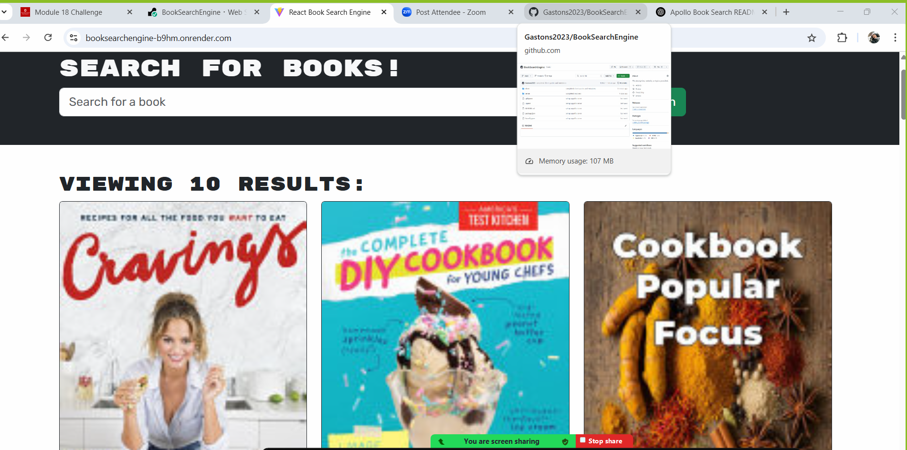

  ## Book Search Engine 
A full-stack MERN application that allows users to search for books via the Google Books API and save their favorites to a personal collection. This app uses Apollo Client and Apollo Server to handle GraphQL queries and mutations.

## Feautures 
Search for books using the Google Books API

Save books to your account

Remove saved books

Authentication with JWT

Built using Apollo GraphQL for efficient data fetching

## Tech Stack

ChatGpt

Frontend: React, Apollo Client, Bootstrap

Backend: Node.js, Express, Apollo Server (GraphQL), MongoDB, Mongoose

Authentication: JSON Web Tokens (JWT)

## 📸 Screenshots

## Contributing
Feel free to fork this project and submit a pull request with improvements!

##  License
This project is licensed under the MIT License.

## Website URL
https://booksearchengine-b9hm.onrender.com/

## Contact
github user: Gastons2023
email: kechara.neal@gmail.com
GitHub Repo: https://github.com/Gastons2023/BookSearchEngine